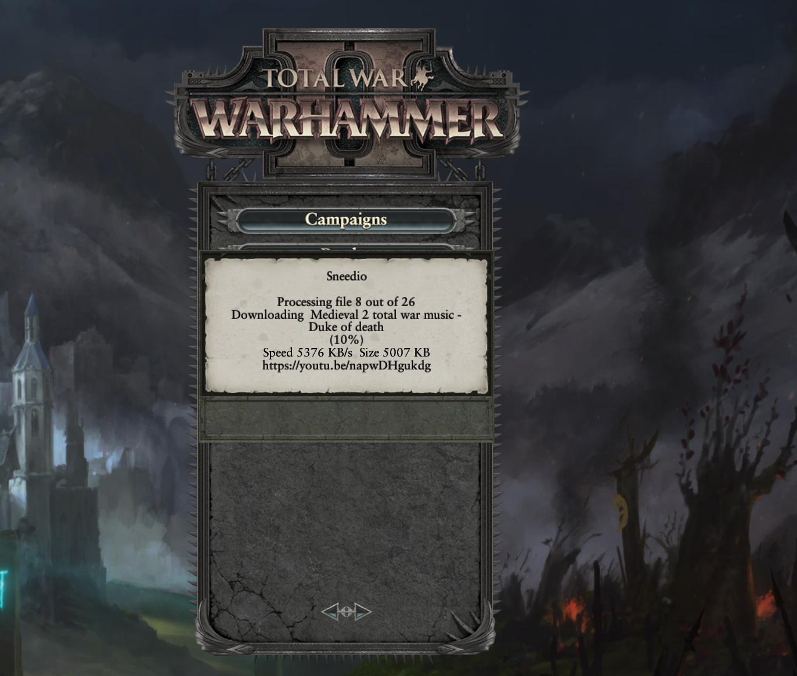

# installation instructions
## steam version
1. Download the latest pack file by subscribing to the [Steam Workshop](https://steamcommunity.com/sharedfiles/filedetails/?id=2784691287).  
     
2. Download the latest binaries from github page [Releases](https://github.com/admiralnelson/warhammer2-libsneedio/releases)  
     
3. Extract the For.Steam.Release.7z to your Warhammer2.exe folder.  
     
4. If there's a prompt to replace files, click Yes to All.  
     
5. Check libsneedio and other music related packs in the launcher.
6. Wait for first time setup. You may get a prompt to download audio assets from youtube.  
     
## non steam version
1. Download the latest binaries from github page [Releases](https://github.com/admiralnelson/warhammer2-libsneedio/releases)  
     
2. Extract the Release.7z to your Warhammer2.exe folder.  
     
3. If there's a prompt to replace files, click Yes to All.  
     
4. Check libsneedio and other music related packs in the launcher.
5. Wait for first time setup. You may get a prompt to download audio assets from youtube.  
     
## development version
follow this page for build instructions: [build.md](build.md)  

---
Go back to [Readme.md](..\readme.MD).