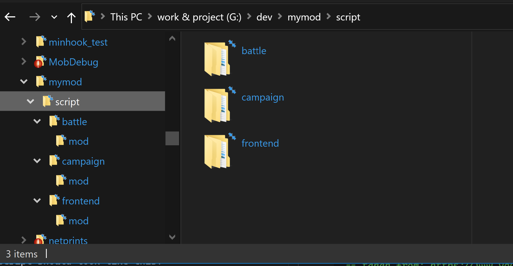
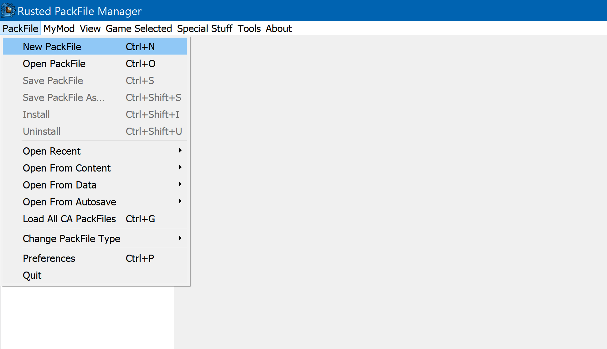
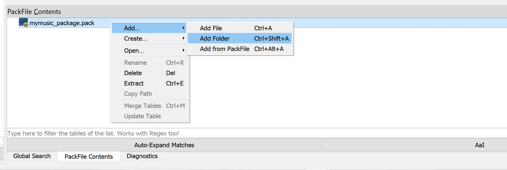
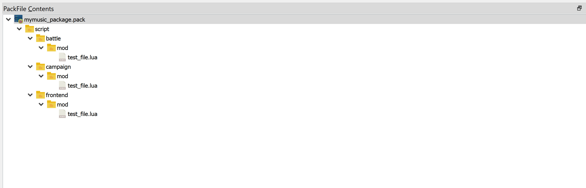

# getting started guide

This guide helps you to get started with sneedio. You can also check out the [documentation](doc/sneedio.md) for API usage and examples.

# creating music packs
You can include your own mp3 inside the packs, but it is recommended to use Youtube links instead. Why?
1. Because music are generally long and have size >4MB. libsneedio uses lua base64 decoding to extract your mp3 file and that is slow, it can also momentarily freeze (or black screen) the game during startup which is not good experience for your user. 
2. No need to encode your files as base64 string. 
3. It's simply easier :^). You can also preview your music links on your code editor (visual studio/vs code/notepad++) by pressing ctrl+click on the link. 
4. Does not slow down your code editor.

Let's create a simple music pack for Bretonnia battle theme, campaign theme, and menu theme.

1. I assume you have [RPFM](https://github.com/Frodo45127/rpfm) and set it up on your computer.
2. Create a working folder on your drive or desktop, whatever suits you.  
3. Create a directory structures like this:  
      
    a. `script/frontend/mod` this is where you download your Youtube URLs. You can also set the music theme here.  
    b. `script/campaign/mod` this is where you set the campaign theme for your factions.  
    c. `script/battle/mod` this is where you set the battle theme for your factions.  
4. Create a single lua file for each directory, name it whatever you like, probably with prefix like music_ or your nickname.  DO NOT PUT SYMBOLS LIKE ! @ # or number at this script filename. This can interfere with libsneedio loading orders.  

Your frontend script should look like this:
```lua
-- utility function to convert mm:ss to seconds
local mmss = sneedio.MinutesSecondsToSeconds;

-- taken from: https://www.youtube.com/playlist?list=PLnuhlOfdJ2WKvIu8eaF3uel9p3VjuK10M
-- declare your music urls like so:
local urls = {
    "https://www.youtube.com/watch?v=eZ_r1H9vHkI",
    "https://www.youtube.com/watch?v=mLpxMXnN7Hw",
    "https://www.youtube.com/watch?v=7unwjDiZegE",
    ---
    "https://www.youtube.com/watch?v=U_jeC2423s8",
    "https://www.youtube.com/watch?v=gRuggMzH3Gw",
    "https://www.youtube.com/watch?v=MRrXKGQocCE"
    -- other music you want to add and use in game
};

-- tell sneedio to download those urls
sneedio.DownloadYoutubeUrls(urls);

-- this will replace player menu music
sneedio.ReplaceMenuMusic(
{
    FileName = "https://www.youtube.com/watch?v=eZ_r1H9vHkI",
    MaxDuration = mmss("3:35"),
    StartPos = mmss("0:00") -- optional, what time to start playing from
});

```
See another example [frontend test_file.lua](../script/frontend/mod/test_file.lua)  

Your campaign music script should look like this:
```lua
-- alias to MinutesSecondsToSeconds, converts mm:ss to seconds
local mmss = sneedio.MinutesSecondsToSeconds;

-- add new music to Bretonnia faction during campaign
-- make sure these links already registered and downloaded during frontend
sneedio.AddMusicCampaign("wh_main_brt_bretonnia",
{
    FileName = "https://www.youtube.com/watch?v=eZ_r1H9vHkI",
    MaxDuration = mmss("3:35"),
    StartPos = mmss("0:00") -- optional, what time to start playing from
},
{
    FileName = "https://www.youtube.com/watch?v=mLpxMXnN7Hw",
    MaxDuration = mmss("1:41"),
},
{
    FileName = "https://www.youtube.com/watch?v=7unwjDiZegE",
    MaxDuration = mmss("3:32"),
});

-- you can add as much as you like as long those URL are registered and downloaded during frontend

-- add new music to Morgiana faction during campaign
sneedio.AddMusicCampaign("wh_main_brt_carcassonne",
{
    FileName = "https://www.youtube.com/watch?v=eZ_r1H9vHkI",
    MaxDuration = mmss("3:35"),
    StartPos = mmss("0:00") -- optional, what time to start playing from
},
{
    FileName = "https://www.youtube.com/watch?v=mLpxMXnN7Hw",
    MaxDuration = mmss("1:41"),
},
{
    FileName = "https://www.youtube.com/watch?v=7unwjDiZegE",
    MaxDuration = mmss("3:32"),
});

-- that's it.
```
See another example [campaign test_file.lua](../script/campaign/mod/test_file.lua)  
Your battle music script should look like this:  
```lua
-- alias to MinutesSecondsToSeconds, converts mm:ss to seconds
local mmss = sneedio.MinutesSecondsToSeconds;

-- add new music to Bretonnia and empire custom battle faction during battle
-- make sure these links already registered and downloaded during frontend

-- It's recommended that you apply playlist to all situations
-- there are 6 situations defined in sneedio modules:
-- * Deployment - when you deploy a unit
-- * FirstEngagement - when you engage against enemy unit after deployment
-- * Balanced - when you engage against enemy unit after first engagement and current battle is balanced
-- * Losing - when you are losing the battle
-- * Winning - when you are winning the battle
-- The situation states looks like this: Deployment -> FirstEngagement -> Balanced -> Losing | Winning
-- You should at least put 2 music in each situation for the best result.

-- for bretonnia custom battle

sneedio.AddMusicBattle("wh_main_brt_bretonnia_mp_custom_battles_only", "Deployment",
{
    FileName = "https://www.youtube.com/watch?v=eZ_r1H9vHkI",
    MaxDuration = mmss("3:35"),
    StartPos = mmss("0:00") -- optional, what time to start playing from
});

sneedio.AddMusicBattle("wh_main_brt_bretonnia_mp_custom_battles_only", "FirstEngagement",
{
    FileName = "https://www.youtube.com/watch?v=mLpxMXnN7Hw",
    MaxDuration = mmss("1:41"),
});

sneedio.AddMusicBattle("wh_main_brt_bretonnia_mp_custom_battles_only", "Balanced",
{
    FileName = "https://www.youtube.com/watch?v=U_jeC2423s8",
    MaxDuration = mmss("3:50"),
},
{
    FileName = "https://www.youtube.com/watch?v=MRrXKGQocCE",
    MaxDuration = mmss("4:44"),
});

-- TODO: add "Losing" and "Winning" playlist down below

```
See another example [battle test_file.lua](../script/battle/mod/test_file.lua)  

After you done with those scripts, create a new pack file, pack them using RPFM like so:  
      
      
      
save, then copy that pack to `data` folder in Warhammer2 directory. Don't forget to enable your pack via launcher.  
Launch your game to test it.

## audio units pack  
work in progress

---
Go back to [Readme.md](../readme.MD).